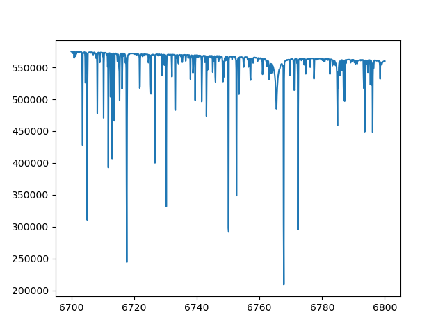

********
Examples
********

Running MOOGPy
==============
You need to supply |moogpy| with 1) a model atmosphere, 2) a linelist (or multiple linelists), and 3) the set of stellar
parameters and abundances.

Here's a simple example:

    >>> from moogpy import synthesis,utils
    >>> atmod = utils.testdir()+'t3710g083m+000.mod'
    >>> linelists = [utils.datadir()+'moogatom.gz',utils.datadir()+'moogh2o.gz']
    >>> flux,cont,wave = synthesis.synthesize(3710.0,0.83,0.0,atmod=atmod,linelists=linelists,wrange=[6700,6800])

Now plot the spectrum:

    >>> import matplotlib.pyplot as plt
    >>> plt.plot(wave,flux)

It should look like this.

Abundances
----------
	
You can modify the global alpha abundance with `am` or individual abundances with `elems`.  The `elems` parameter
takes a list of [element name, abundance] pairs, where the abundance should be in the form [X/M], where M is the
overall metallicity that is used to scale the individual abundances.  For example, ``elems=[['Mg',0.55],['Ba',-0.15]]``
means a relative Magnesium abundance of +0.55 and a relative Barium abundance of -0.15.

Let's try it out:

    >>> flux2,cont2,wave2 = synthesis.synthesize(3710.0,0.83,0.0,atmod=atmod,linelists=linelists,wrange=[6700,6800],elems=[['Mg',0.55],['Ba',-0.15]])
    >>> plt.plot(wave,flux)
    >>> plt.plot(wave2,flux2)
    >>> plt.xlim(6700,6800)
